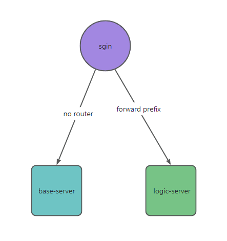

# sgin
sgin是基于gin框架的一层封装，集成了一些常用的业务组件，可以基于此框架快速开发应用。

或者也可以把sgin框架放在业务服务的前面，这样子sgin也可以作为一个网关来使用。不过这个网关比较特殊，有一些业务组件，比如用户管理、权限管理等。这样子业务服务可以不用再去实现sgin已经有的基础功能服务，只需要实现自己的业务服务即可。

关于安全方面，业务服务配置只可以sgin访问即可。

### 为什么弄这个框架
- 1. 集成一些常用的业务组件
- 2. 为了快速开发
- 3. 为了学习

### 特性
- 1. 支持swagger文档生成
- 2. 集成gorm
- 3. 集成redis
- 4. jwt认证
- 5. 集成zap日志
- 6. 集成viper配置文件
- 7. 集成casbin权限管理
- 8. 集成邮件服务
- 9. 丰富的中间件（请求和响应日志hook、用户认证、签名校验、api请求权限等）
- 10. 路由转发
- 11. API接口限流

### 功能
- 1. 用户管理
- 2. 角色管理
- 3. 权限管理
- 4. 菜单管理
- 5. 邮件验证码
- 6. 文件上传
- 7. 团队管理
- 8. APP调用方管理
- 9. API接口权限管理

### swagger
[swagger操作文档](https://github.com/swaggo/swag/blob/master/README_zh-CN.md)

- 生成swagger文档
> swag init 
