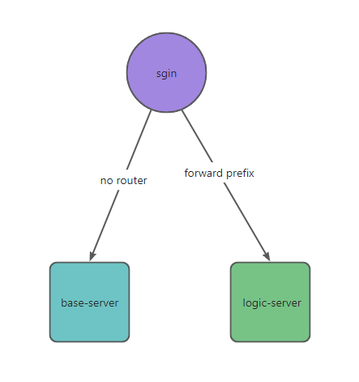

# sgin
sgin是基于gin框架的一层封装，集成了一些常用的业务组件，可以基于此框架快速开发应用。

或者也可以把sgin框架放在业务服务的前面，这样子sgin也可以作为一个网关来使用。不过这个网关比较特殊，有一些业务组件，比如用户管理、权限管理等。这样子业务服务可以不用再去实现sgin已经有的基础功能服务，只需要实现自己的业务服务即可。

关于安全方面，业务服务配置只可以sgin访问即可。



### 为什么弄这个框架
- 1. 集成一些常用的业务组件
- 2. 为了快速开发
- 3. 为了学习

### 特性
- 1. 支持swagger文档生成
- 2. 集成gorm
- 3. 集成redis
- 4. jwt认证
- 5. 集成zap日志
- 6. 集成viper配置文件
- 7. 集成casbin权限管理
- 8. 集成邮件服务
- 9. 丰富的中间件（请求和响应日志hook、用户认证、签名校验、api请求权限等）
- 10. 路由转发
- 11. API接口限流

### 功能
- 1. 用户管理
- 2. 角色管理
- 3. 权限管理
- 4. 菜单管理
- 5. 邮件验证码
- 6. 文件上传
- 7. 团队管理
- 8. APP调用方管理
- 9. API接口权限管理


### swagger
[swagger操作文档](https://github.com/swaggo/swag/blob/master/README_zh-CN.md)

- 生成swagger文档
> swag init 

### 运行与配置
- 启动
```powershell
go build
./sgin.exe
```

- 关键环境变量
	- `SERVER_PORT`: 服务端口（如 8080）
	- `LOG_FILE`: 日志文件路径，对应 `LogConfig.Filename`
	- `MYSQL_HOST`/`MYSQL_PORT` 等：数据库连接
	- `ALLOWED_ORIGINS`: 允许跨域来源，逗号分隔（如 `https://foo.com,https://bar.com`）
	- `PASSWD_KEY`: 用于密码与 JWT 签名的密钥

- 健康检查
	- `GET /ping`: 基础存活检查
	- `GET /healthz`: 应用健康检查
	- `GET /readyz`: 就绪检查（会探测 DB/Redis 可用性）

### 安全与稳定性
### 扩展配置（插件式）

如果你把 `sgin` 作为一个库嵌入到你的应用中，可以按插件式方式扩展配置与运行时行为。本仓库提供了两类机制：

- `config.RegisterExtension(name, fn, strict)`：插件在自己的 `init()` 中注册一个回调，框架在加载主配置后（`config.InitConfig`）会依次调用这些回调，回调负责从底层 viper 中解码自己的配置段并做轻量初始化；当 `strict=true` 时，回调失败会导致启动失败（fail-fast）。
- `app.WithExtra(name, key, out)` / `NewAppWithOptions`：在创建 `App` 时将已解码的自定义结构注入 `App.Extras`，运行时可以通过 `App.GetExtra(name)` 或泛型 `GetExtraAs[T]` 安全取回具体类型。

示例代码与运行方式（仓库中包含两个示例）：

1) 插件式示例 — `examples/plugin_demo`

插件在 `examples/plugin_demo/plugin/plugin.go` 中：

```go
func init() {
	config.RegisterExtension("myplugin", func(v *viper.Viper, cfg *config.Config) error {
		var c MyExtra
		if err := v.UnmarshalKey("myplugin", &c); err != nil {
			return err
		}
		// 保存到插件包内的全局变量，或做轻量初始化
		Conf = &c
		return nil
	}, false)
}
```

主程序通过 `plugin.Setup(a)` 在 App 创建后注册路由：

```go
a := app.NewAppFromConfig(config.GetConfig())
plugin.Setup(a)
```

运行示例：
```powershell
go run ./examples/plugin_demo
```

访问： `http://localhost:8080/plugin/hello`（若配置 `feature_flag: true`）

2) `WithExtra` 示例 — `examples/withextra`

方式 A（手动解码并注入）：
```go
var extra MyExtra
_ = config.UnmarshalKey("my_extra2", &extra)
a := app.NewAppWithOptions(app.WithExtra("manual_extra", "my_extra2", &extra))
```

方式 B（直接把指针传入让 `WithExtra` 内部解码）：
```go
a := app.NewAppWithOptions(app.WithExtra("auto_extra", "my_extra2", &MyExtra{}))
```

运行示例：
```powershell
go run ./examples/withextra
```

注意与最佳实践：
- 推荐在启动阶段（`main`）显式使用 `config.UnmarshalKey` 解码并校验扩展配置，然后把已解析的结构注入 `App`（更类型安全、可控）。
- `RegisterExtension` 适合插件/第三方包在 `init()` 中声明自己的配置解析逻辑；若插件需要在 App 生命周期注册路由或中间件，请同时使用 `app.RegisterPlugin` 或在 `App` 初始化后调用插件的 `Setup(a *app.App)`。
- 插件回调应尽量保持轻量（仅解析配置或构造轻量对象）；重型阻塞初始化建议放在 `app.RegisterPlugin` 的回调中运行时完成。

如果需要，我可以将以上示例运行说明合并到 README 的更醒目位置，或添加一个 `Makefile` / PowerShell 脚本以便一键运行示例。


### 作为库使用（嵌入式接入）

你可以把 `sgin` 当作一个可复用的库，在宿主项目中创建 `App`，并以插件化方式注入路由/中间件：

示例（在宿主项目中）:

```go
import (
	"github.com/luxingwen/sgin"
	"github.com/luxingwen/sgin/pkg/app"
)

func main() {
	a := sgin.NewApp()
	// 插件式注册
	sgin.RegisterPlugin(a, func(a *app.App) {
		a.GET("/hello", func(ctx *app.Context) { ctx.JSONSuccess("hello") })
	})
	// 启动（会阻塞直到收到停止信号）
	_ = sgin.Start(a, "")
}
```

开发提示:
- `sgin.RegisterPlugin` 和 `app.App.RegisterPlugin` 都可以用来注入路由或中间件。
- 如果你想在非 HTTP 场景使用部分功能，可以使用 `pkg/app` 中的 `AppContext` 与 `NewBackgroundContext`。

